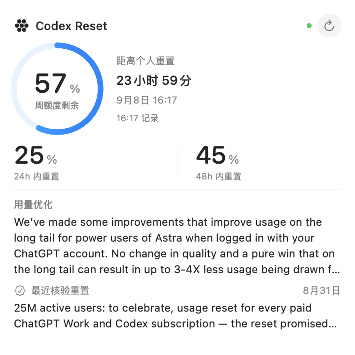
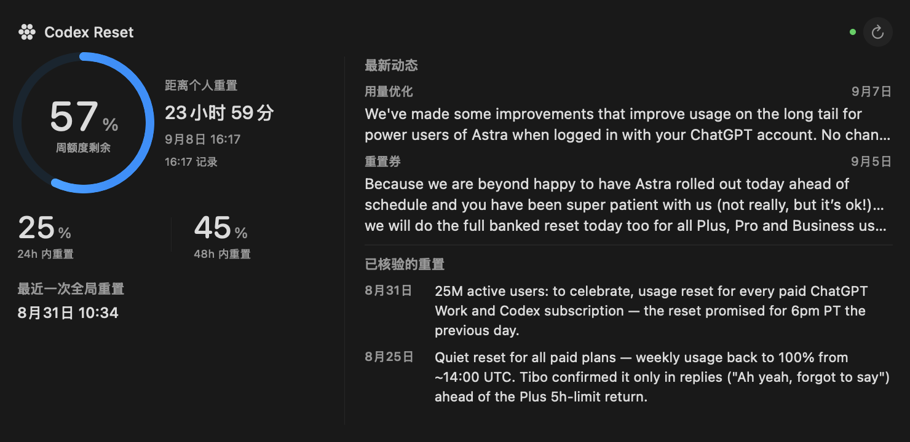

# Codex Reset for macOS

原生 SwiftUI 应用 + WidgetKit 桌面/通知中心小组件，直接读取 [codex-reset.com](https://codex-reset.com) 的公开接口。

## 功能

- **公告动态**：Tibo 的最新消息，保留网站提供的分类和原文链接。
- **历史重置**：展示重置记录，区分站点已核验的归档和待核验动态。
- **概率预测**：展示站点计算的未来 24 / 48 小时重置概率与低置信度提示。
- **个人周用量**：只读连接本机 Codex 的用量记录，提取已用百分比、重置时间和记录时间；也可手动填写。通过 App Group 与小组件共享，到期后等待新记录，不自动假定额度恢复。
- **大号**：额度环、重置倒计时、双窗口预测、重点公告和最近核验日期。
- **超大号**：左侧显示个人用量与预测，右侧展示 2 条重点公告和 2 条核验记录。点击打开主应用。
- 原生侧栏分为概览、公告、重置历史；概览筛选重置/用量相关动态，公告页可切换全部/重点，历史页可切换已核验/全部。浅色与深色跟随系统。

## 界面预览

以下是布局渲染预览，使用示例个人用量，不是实际账号截图。桌面上的材质、边缘和着色由 WidgetKit 管理。




## 构建和运行

需要 macOS 14+、Xcode 15+ 和本机可用的 Apple Development 签名证书。

1. 打开 `CodexReset.xcodeproj`。
2. 新建 `Config/Local.xcconfig`（已被 Git 忽略），填写自己的 Team ID：

   ```xcconfig
   DEVELOPMENT_TEAM = YOUR_TEAM_ID
   ```

3. 选择 **CodexReset** scheme，运行，或执行：

   ```bash
   ./script/build_and_run.sh --verify
   ```

App 和 Widget 共用 `$(DEVELOPMENT_TEAM).com.cherine.codex-reset` App Group。签名团队必须一致。分发版本需自行完成相应签名与公证；本仓库不包含证书或凭证。

运行主应用后，右键桌面 → **编辑小组件** → 搜索 **Codex Reset**，选择所需尺寸。若列表尚未出现，先将已构建的 App 拖入“应用程序”并打开一次。

本地开发请使用 `script/build_and_run.sh` 更新。脚本在构建成功后同时重启主应用和本项目的小组件扩展，避免 WidgetKit 继续运行旧二进制而显示旧版界面；不会重启通知中心或其他应用的小组件。

## 数据与刷新

| 内容 | 读取位置 |
| --- | --- |
| 公告 | `GET https://codex-reset.com/api/feed` |
| 历史 | `GET https://codex-reset.com/api/timeline` |
| 预测 | `GET https://codex-reset.com/api/forecast?tz=<本机时区>` |
| 个人用量 | 授权的 `~/.codex/sessions` 中 `token_count.rate_limits`，或手动填写；仅提取所需字段存入本机 App Group 的 `personal.json` |

应用打开期间每 5 分钟刷新，可用 ⌘R 手动刷新。小组件申请每 15 分钟刷新，实际时间由 macOS 调度，不能保证准点。请求失败时保留最近可用内容并显示过期/失败状态，三个接口独立失败不会清空其他数据。

大号和超大号右上角均有刷新按钮，直接触发新的小组件时间线，重新获取公告、历史和预测，无需打开主窗口。个人用量仍读取主应用最近同步的本地记录。

### 连接本机 Codex

点击 **连接本机 Codex…**，在系统文件夹选择器中按 **⌘⇧G**，输入 `~/.codex/sessions`，选择“连接”。应用保存只读的 security-scoped bookmark，重新启动后继续读取；点击“断开”可清除连接和当前用量记录，恢复手动模式。自定义 `CODEX_HOME` 时选择对应目录下的 `sessions`。

读取的是 **Codex 最近记录的账号额度快照**，不是主动查询 OpenAI 的实时账号接口。仅接受 `limit_id == codex`，按 `window_minutes == 10080` 查找周窗口，不把 primary 固定当成 5 小时，也不混入 Spark 等独立额度。扫描最近 14 天目录中的最新 32 个文件，各读取末尾最多 2 MiB；没有可用记录会显示提示。

应用打开期间随刷新更新，小组件读取应用已同步的快照；应用关闭后不会继续扫描 Codex 记录。记录超过 30 分钟时显示“待更新”。账户切换后需等待 Codex 产生新的用量记录。此本地日志格式不是稳定公共接口，未来 Codex 版本可能需要调整解析器。

应用只向站点发送公开接口 GET 请求，不读取 ChatGPT 登录凭证，不上传会话、个人用量或重置时间，不调用站点的个人重置上报接口。扫描期间会在内存读取文件尾部，仅解码用量事件并保存额度字段。请求会像普通网站访问一样向站点暴露 IP 和时区。个人记录不会自动同步网站浏览器里的 localStorage。

这是第三方站点的数据展示工具，与 OpenAI 和源站没有隶属关系。预测属于源站的实验模型，并非重置承诺。站点接口未提供本项目可依赖的版本/可用性保证，接口变化可能需要更新解析代码。公告文本版权归原作者所有，保留来源链接。

## 检查

```bash
swift test
LIVE_API_TEST=1 swift test --filter testLiveEndpointsWhenRequested
LIVE_CODEX_TEST=1 swift test --filter CodexUsageTests
./script/build_and_run.sh --build
```

核心测试覆盖 API 时间格式、缓存过期、请求失败保留缓存、个人记录到期逻辑、来源链接限制、Codex 周窗口选择、额度桶隔离和最新记录选择。真实接口与本机 Codex 检查默认跳过，通过环境变量显式启用。

## 代码布局

- `Shared/`：数据模型、HTTP 客户端、App Group 存储
- `App/`：应用入口和状态
- `Views/`：预测、公告、历史、个人用量界面
- `Widget/`：WidgetKit 时间线和三种尺寸
- `Config/`：签名配置、Info.plist 和 entitlements
- `Tests/`：核心逻辑及可选实时接口检查
